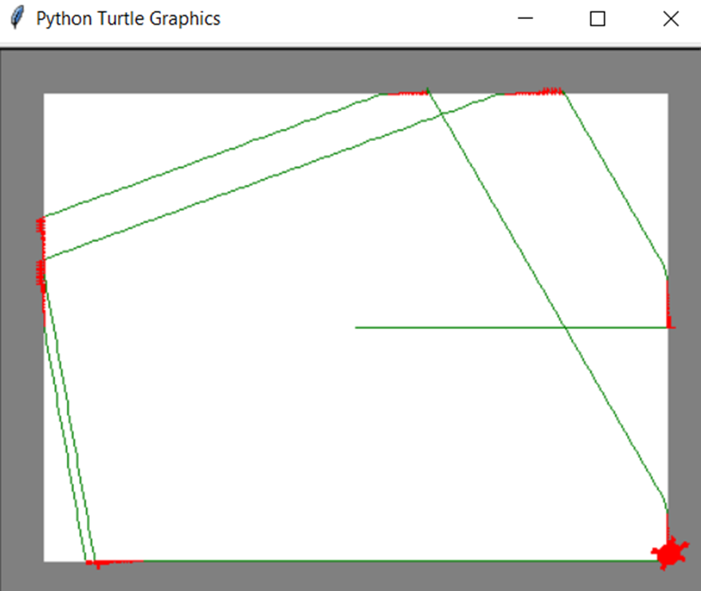

# README of the Developmental AI for ROS project

# Explication 

La tortue à pour instruction d'aller tous droit et lorsque celle-ci rencontre un mur elle va changer 
sa trajectoire jusqu'à ce que il n'y est plus d'obstacle devant elle.

La tortue va donc effectuer le tour de son espace de jeu, néanmoins avec ce code-ci elle ne fait 
pas un tour parfait, pour cela il faudrait etre plus precis dans les valeurs et la faire tourner un peu moins
lorsqu'elle rencontre un mur pour qu'elle puisse le raser. 

Lorsque l'on test celui-ci avec le robot on voit qu'il rase les murs grace au capteur et au repositionnement du robot

# Exemple 

Photo : 

